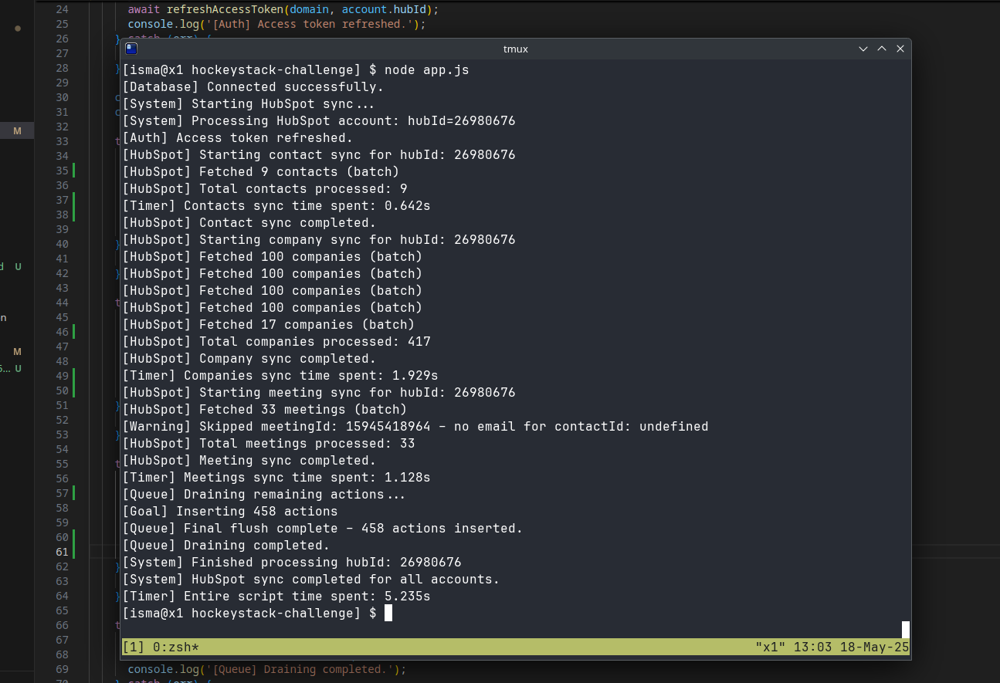

# API Sample Test

## Result



- [Timer] Contacts sync time spent: 0.642s
- [Timer] Companies sync time spent: 1.929s
- [Timer] Meetings sync time spent: 1.128s

> Final run completed in ~5.23s, indicating no request exceeded the 5-second guideline. The sync process ran efficiently and within the expected performance limits.


## Debrief

### (1) Code Quality & Readability

- Logging was initially unstructured but was improved using consistent contextual tags.
- The code contains multiple repetitive `try/catch` blocks and duplicated logic in entity processors (`processContacts`, `processCompanies`, `processMeetings`), which could be abstracted into shared helpers to reduce duplication and improve maintainability.
- The token refresh logic uses `.then()` chains inside `async` functions, which is inconsistent with modern `async/await` style and could be refactored for better clarity and error handling.
- Hardcoded property lists are used when fetching records from HubSpot, which makes updates tedious and error-prone. Extracting them into constants would improve flexibility and readability.
- There is no test suite or input validation. Even minimal test coverage or runtime schema validation (e.g., with `zod` or `joi`) would greatly improve confidence and reduce the risk of regressions.

### (2) Project Architecture

- The original codebase was monolithic, with all core logic bundled into a single `worker.js` file. This structure made the code hard to test, extend, or reason about.
- We refactored the project into a modular structure, separating logic by entity type and isolating shared concerns (e.g., access tokens, queueing). This improves separation of concerns and makes the system more scalable.
- Reusable logic like account lookups and pagination patterns should also be extracted to shared utilities to further improve consistency and maintainability.
- The project does not define a Node.js version using `.nvmrc` or `package.json > engines`, which could lead to environment mismatches. For this task, Node.js v23.11.0 was used and managed via `asdf` to ensure consistency across environments.

### (3) Code Performance

- The original ETL process took over 10 minutes due to a critical bug in the date filtering logic. It used invalid operators (`GTQ` and `LTQ`) instead of the correct `GTE` and `LTE`, causing repeated retries and delays. Fixing this dramatically improved sync performance.
- Meeting ingestion was implemented using the legacy Engagements API with proper pagination (`offset`) and filtering for `type: MEETING`.
- Retry logic follows exponential backoff but does not support concurrency, which limits throughput, especially when dealing with large datasets.
- There is no caching, pipelining, or concurrency at the request level. Batching is size-based only (e.g., 2000+), which works but leaves performance gains on the table.
- Enforcing per-request timeouts (as suggested in the README) and parallelizing independent entity fetches would significantly improve performance under load.

## Getting Started

1. Install dependencies:
   ```bash
   npm install
   ```

2. Set up the environment:
   - Rename `.env.example` to `.env`
   - Fill in required values (e.g., `HUBSPOT_CID`, `HUBSPOT_CS`, `MONGO_URI`)

3. Run the app:
   ```bash
   node app.js
   ```

> Ensure Node.js v23.11.0 or higher is used.

## Project Overview

This project pulls and processes company and contact data from HubSpot's CRM API. Contacts are associated with companies via HubSpot's association API. The system simulates ingestion by building actions in memory without writing to a database. The `Domain` model represents a HockeyStack test account. Only the `hubspot` object in `integrations` is relevant.

The `server.js` file is present but not required for this challenge.

HubSpot requests should complete in under 5 seconds. Longer durations may indicate an implementation issue.

---

> This project used [`ripissue`](https://github.com/cwnt-io/ripissue) to manage issues from the command line.
