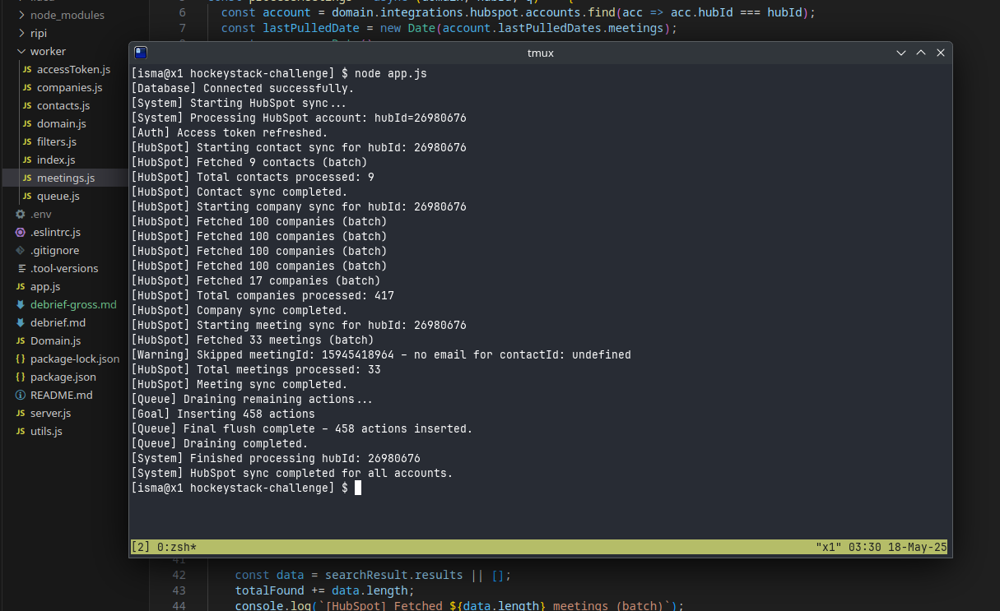

# API Sample Test

## Result




## Debrief

## (1) Code Quality & Readability

- Inconsistent logging improved with contextual tags for traceability.
- Dense expressions (e.g., expiration date calc) could be split into named constants.
- Lacks input validation; defensive checks would prevent runtime errors.
- Some `.then()` usage could be replaced with `async/await` for clarity.
- Unused variables (e.g., `propertyPrefix`) and sparse comments reduce readability.
- Repetitive logic across entity functions (`contacts`, `companies`, `meetings`) could be abstracted.
- `fetchWithPagination()` was proposed to centralize pagination/retry logic.

### (2) Project Architecture

- All logic is packed into `worker.js`, making the project hard to scale or test.
- Proposed modular structure (`/entities`, `/shared`) would improve separation of concerns.
- Shared logic like account lookup and queue flushing should be extracted.
- Missing tooling like `.nvmrc` and Docker can cause environment mismatches.
- Node.js version is not pinned (`.nvmrc` or `engines`), which could cause version mismatches; I used Node.js 23.11.0 for this task.


### (3) Code Performance

- Original ETL run took 10+ minutes due to incorrect filter operators (`GTQ`, `LTQ`) — fixed by using `GTE`, `LTE`.
- Meeting ingestion implemented via legacy Engagements API using correct `offset` pagination and `type: MEETING` filtering.
- Retry logic uses exponential backoff but lacks concurrency, limiting throughput.
- No caching or request pipelining; batching is only based on size (2000+).
- Could improve with parallel entity fetches and enforcing 5s timeout per API call (as suggested in the README).


## Getting Started

This project requires a newer version of Node. Don't forget to install the NPM packages afterwards.

You should change the name of the ```.env.example``` file to ```.env```.

Run ```node app.js``` to get things started. Hopefully the project should start without any errors.

## Explanations

The actual task will be explained separately.

This is a very simple project that pulls data from HubSpot's CRM API. It pulls and processes company and contact data from HubSpot but does not insert it into the database.

In HubSpot, contacts can be part of companies. HubSpot calls this relationship an association. That is, a contact has an association with a company. We make a separate call when processing contacts to fetch this association data.

The Domain model is a record signifying a HockeyStack customer. You shouldn't worry about the actual implementation of it. The only important property is the ```hubspot```object in ```integrations```. This is how we know which HubSpot instance to connect to.

The implementation of the server and the ```server.js``` is not important for this project.

Every data source in this project was created for test purposes. If any request takes more than 5 seconds to execute, there is something wrong with the implementation.

---

> This project used [ripissue](https://github.com/cwnt-io/ripissue) ([crates.io](https://crates.io/crates/ripissue)) to track and manage the issues directly from the command line.
